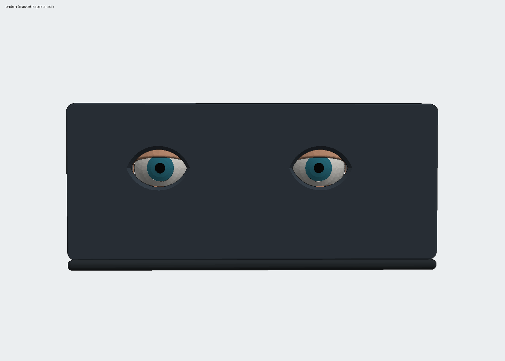
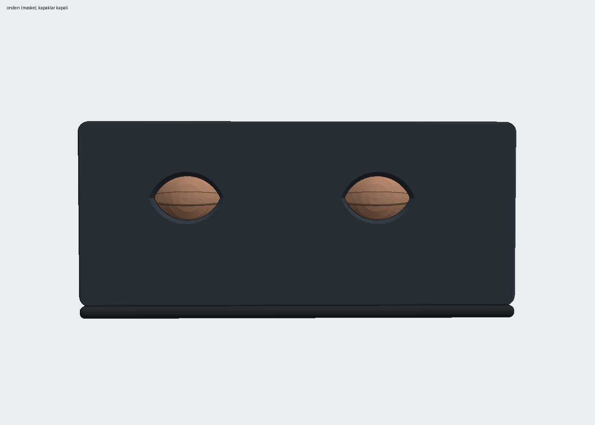
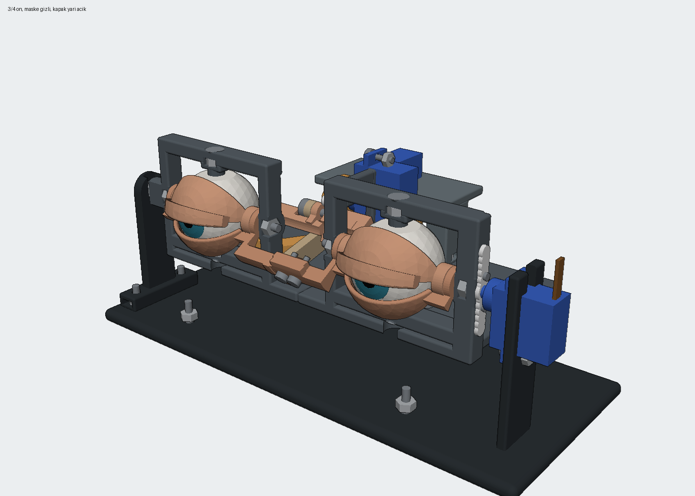
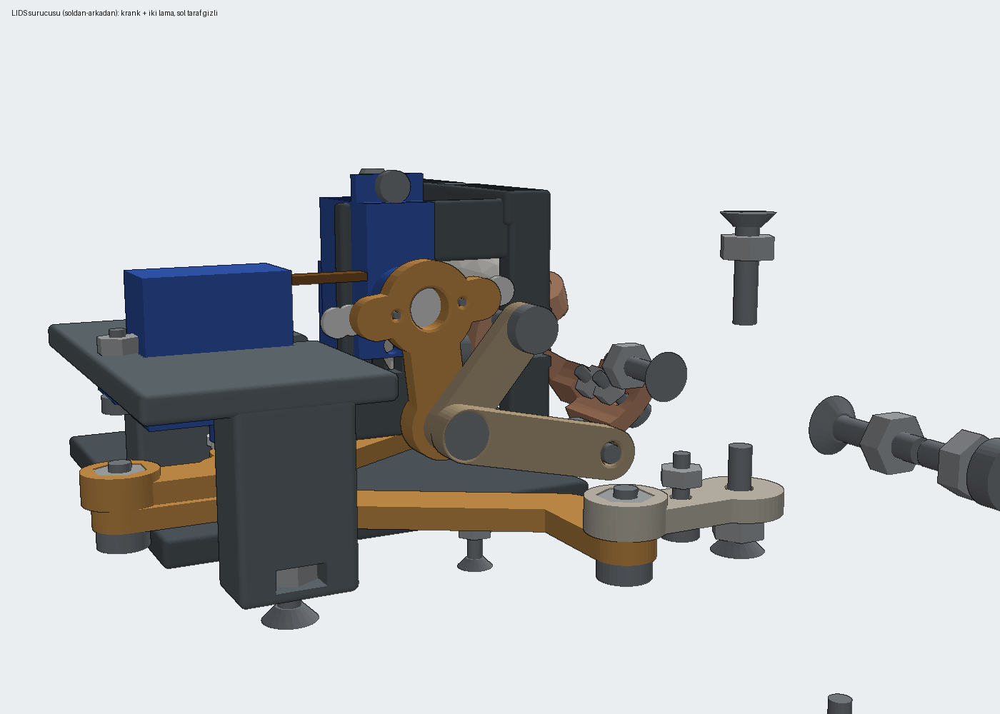

# Project Eye

An animatronic eye mechanism: two eyes that look left/right and up/down, with upper and lower eyelids that blink. Three SG90 micro servos, an Arduino Uno, 3D-printed PLA parts and M3/M4 screws with nuts. Built in a few days as the first module of **Epic Project**, a personal series of human-augmentation builds.



| Eyelids closed | Three-quarter view | Eyelid drive |
|---|---|---|
|  |  |  |

## How it was made

The mechanism was designed as code with AI agents (Claude Code), directed and verified on real hardware by me.

- **CAD as code.** Every part is generated with [CadQuery](https://cadquery.readthedocs.io) from one parameter file (`cad/params.py`). Measured tolerances from printed test pieces go into that file and all parts regenerate.
- **Automatic checks.** After every change the mechanism is swept through 75+ poses (yaw × pitch × eyelid) to check for collisions and minimum clearance (`check.py`). Separate checks catch screws left floating in air (`check_havada.py`) and screws a hand cannot reach in assembly order (`check_montaj.py`). Each of these checks exists because I caught that exact mistake on a printed part.
- **Firmware and control.** Arduino firmware with clamped angle limits taken from the kinematics, a Python serial control library with 45+ unit tests and a simulator, and a button-driven calibration panel.
- **Viewer.** `model.html` is a self-contained 3D viewer of the assembly with live pose sliders.

## Versions

Every version is kept; a revision never edits an older folder.

| Version | What changed |
|---|---|
| v1 | Concept model (viewer only) |
| v2 | Full mechanism: 2 eyes, 4 lids, 6 servos, M2 hardware, ball joints. Software complete, never built |
| v3 | Simplified for a hobby printer: 3 servos, M3/M4 screw pins instead of ball joints |
| v4 | Lower lids on the same servo as the upper lids, front mask, fillets; irises fully covered when closed |
| **v5** | **Built and running.** Captive hex nuts at every joint, separate iris and pupil inserts, base split in two for a 220 mm bed, cable slots on the correct servo end |

## v5 at a glance

| | |
|---|---|
| Servos | 3 × SG90: yaw D3, pitch D5, eyelids D6 |
| Board | Arduino Uno, 115200 baud, command `S <yaw> <pitch> <lids>` → `OK` |
| Button | D2 to GND: neutral ↔ idle (LED 13 on in idle) |
| Calibrated range | yaw 45–111° (center 78), eyelids open 80° / closed 115° |
| Parts | 19 STL files, 22 prints, about 250–320 g PLA |
| Hardware | M4×16 countersunk, M4×10 and M3×10 pan head, M3/M4 nuts (see `v5/cad/BOM.md`) |

Folder layout (`v5/`):

```
cad/        params.py, eye_v5.py (geometry), kin.py (kinematics), check*.py, out/ (STL, STEP, GLB, renders)
firmware/   project_eye_v5 (main sketch); notr_yaw_d3, montaj_lids_d3 (assembly helpers)
control/    eye_control.py, sim.py, calibrate.py, kalibrasyon_paneli.py (calibration GUI), face_follow.py, tests/
viewer/     build_viewer.py + template.html → model.html
MONTAJ.md   assembly order (Turkish)
```

## Run it

```powershell
# CAD (Python 3.12 + cadquery)
cd v5/cad
python eye_v5.py; python check.py; python check_havada.py; python check_montaj.py

# Firmware (arduino-cli, board arduino:avr:uno)
arduino-cli compile --fqbn arduino:avr:uno v5/firmware/project_eye_v5
arduino-cli upload  --fqbn arduino:avr:uno -p COM3 v5/firmware/project_eye_v5

# Control (pyserial)
cd v5/control
python -m unittest discover tests
python kalibrasyon_paneli.py --port COM3
```

`face_follow.py` needs mediapipe, OpenCV and a BlazeFace model file; its default path points to my local setup, so pass your own model path.

## Known issues

- **Pitch is weak when looking down.** The parts that tilt with the pitch servo weigh about 225 g, and their center of mass sits about 23 mm behind the pitch axis. Holding it takes about 0.5 kg·cm, roughly 30% of an SG90's stall torque before losses. Fixes: an MG90S (same size, metal gears), a small spring or foam pad under the rear of the frame, and a separate 5 V supply for the servos. Pitch limits (70–110°) are still the model values and have not been calibrated.
- **Servo power.** Running three servos from the Uno's 5 V pin causes brown-out resets on fast moves. Use a separate 5–6 V supply with a shared ground.

## Next

- Face tracking on v5 hardware (`control/face_follow.py`)
- v6: move the center of mass onto the pitch axis

Docs and code comments are partly in Turkish.
